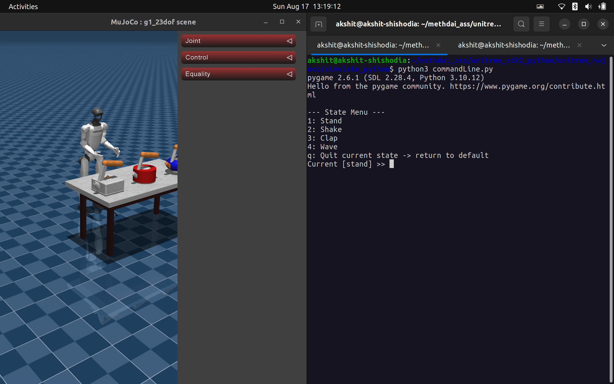
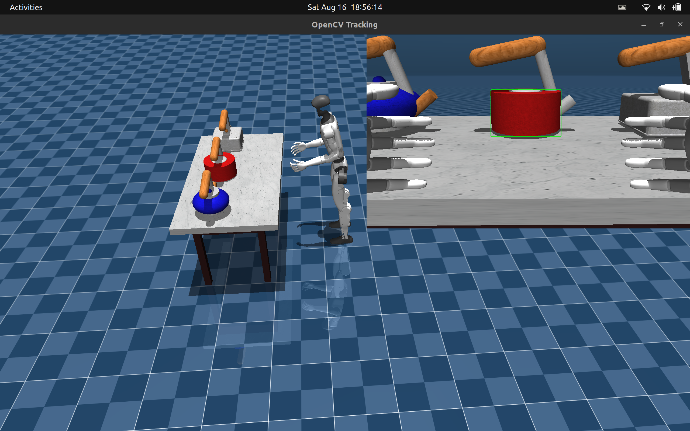
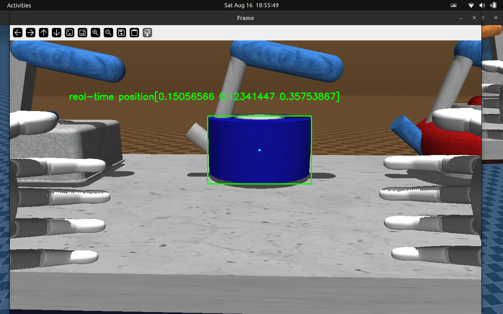
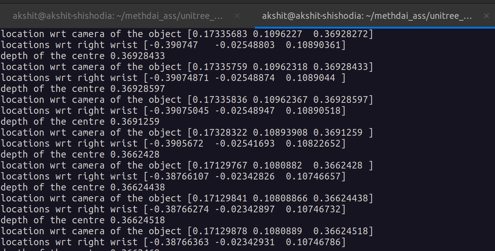

# Unitree Mujoco Playground

Unitree MuJoCo Playground is an interactive simulation environment that lets you control and experiment with Unitree robots in a fully virtual MuJoCo setup. It provides a hands-on playground to test robot behaviors, try out commands, and explore dynamics in a safe, simulated space.

## Current Features

- Command Line Features to control a G1 Unitree using Position Control (PD-Control) using Unitree's SDK2 bridge providing smooth integration with original Cyclone DDS communication with Unitree real Humanoids.

- A Camera pipeline and utilities to track and localise object within FOV using OpenGL in Mujoco.

## Installation 
Clone the repo

```
cd
git clone https://github.com/Akshit0601/Unitree-G1-Mujoco-Playground.git
```
### Dependencies
Make sure to install mujoco and pygame.
```
pip3 install mujoco
pip3 install pygame
```
or simply run 

```
cd Unitree-G1-Mujoco-Playground
pip3 install -r requirements.txt
```

### Install as editable in Env

```
pip3 install -e .
```
This will install the package inside your current environment

## Running 

### Position Control

First launch the command line Interface

```
cd unitree_mujoco/simulate_python/
python3 commandLine.py  
```
Launch Mujoco.viewer

```
python3 unitree_mujoco.py
```

<p align="center">
  
</p>
Follow along the CLI to test various functions.

### Image Pipeline

```
cd unitree_mujoco/simulate_python/
python3 commandLine.py 
```
In another terminal run,
```
python3 track.py
```
<p align="center">
  
  
  
</p>

